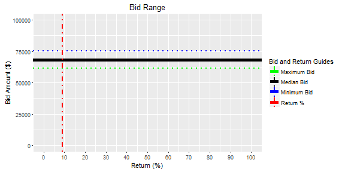

## Purpose of Deal Analyzer App

This app is designed to be used by investors, realtors, companies, or individuals LIKE YOU interested
in purchasing distressed property, repairing and renovating the property, then reselling the 
updated property for a PROFIT.

It can be difficult to know what you should bid on any given property in order to make a profit since so many variables are involved and sometimes you just have to make guesses as to what your bid should be and hope for the best!

This app can help guide the decision making process by providing a dynamic interface that automatically calculates an appropriate range of bids based on your best estimates of all the input variables. Because the output is dynamic, you can easily see how changing the various inputs affects the amount you should bid!

--- .class #id 

## Inputting Data

To use the app, all you have to do is enter values for a few variables using simple slider bars. Normally, it would be difficult to keep all of these variables in your mind at once when trying to think of an appropriate bid. This app does it all for you!

1. "Estimated Repair Costs"
    This value is entered as a range of dollar amounts. This is your best guess at how much it will cost to renovate and/or repair the property prior to reselling it.
        
2. "Monthly Loan and Tax Cost"
    This value is the cost of the loan and taxes that must be paid on the property each month during the renovation period.
    
3. "Months Needed for Repair"
    This value is the number of months it will take to renovate the property
    
4. "House Value After Repairs"
    This value is the estimated value of the property after all repairs and renovations are complete.
    
5. "Return on Cash Desired"
    This value is the desired percent return on the your cash investment

---

## Model Output: What You Should Bid

The app automatically outputs the minimum and maximum bid you would need to make on the property to receive the desired return on investment based on the input variables you chose. There are two bid values (min and max) because the Estimated Repair Costs are given as a range of values. As an example, if your input values are:  
* Estimated Repair Costs = $15,000-$30,000  
* Monthly Loan and Tax Cost = $1000 | Months Needed for Repair = 3  
* House Value After Repairs = $100,000 | Return on Cash Desired = 9%  


```r
library("scales")
repaircostlow<-15000;repaircosthigh<-30000;monthcost<-1000;months<-3;sellprice<-100000;return<-9
bidlow<-(repaircostlow+(monthcost*months)-sellprice)/(-1*(1+(return*.01)));bidlow <- dollar(round(bidlow,digits=0))
bidhigh<-(repaircosthigh+(monthcost*months)-sellprice)/(-1*(1+(return*.01)));bidhigh <- dollar(round(bidhigh,digits=0))
```
  
The model will tell you that your minimum bid should be $75,229 and your maximum bid should be $61,468

---

## Dynamic Visual Output

The app also outputs a plot so you can visualize the maximum bid, the minimum bid, the median bid, and the percentage return on investment that you selected. This plot is reactive, so you can play around with different input values to see how they change the bid ranges. With smarter, more accurate bids, you can increase your sales volumes and ultimately your profits!


